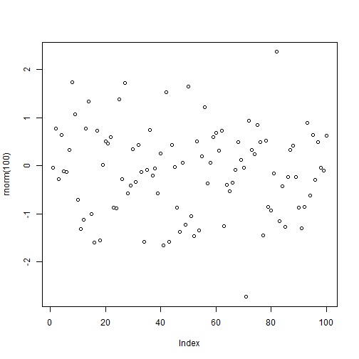

<br>
<br>
<b>Github Account Username:</b> <a href="https://www.github.com/mershar">mershar</a>
<br>
<br>

<hr>
### Synopsis
<p>Assignment 0 is based on completing exercises from this document <a href="https://cran.r-project.org/doc/contrib/Torfs+Brauer-Short-R-Intro.pdf">A (very) short introduction to R</a> and submitting the code on GitHub. The document is an introduction to R language which consists of explanations, examples, and exercises that will help people without programming experience.</p>
<hr>

<br>
<br>

<b>1. ToDo</b>
<p>Compute the difference between 2014 and the year  you  started  at  this  university  and  divide this by the difference between 2014 and the year you  were  born.   Multiply  this  with  100  to get the  percentage  of  your  life  you  have  spent  at this university.  Use brackets if you need them.</p>


```r
((2015-2014)/(2016-1987)*100)
```

```
## [1] 3.448276
```

<hr>
<b>2. ToDo</b>
<p>Repeat  the  previous  ToDo,  but  with  several steps  in between.   You  can  give  the  variables any name you want, but the name has to start with a letter.</p>


```r
a <- ((2015-2014)/(2016-1987)*100)
a
```

```
## [1] 3.448276
```

<hr>
<b>3. ToDo</b>
<p>Compute the sum of 4, 5, 8 and 11 by first combining  them  into  a  vector  and  then  using  the function sum.</p>


```r
sum(c(4,5,8,11))
```

```
## [1] 28
```

<hr>
<b>4. ToDo</b>
<p>Plot 100 normal random numbers.</p>


```r
plot(rnorm(100))
```



<hr>
<b>5. ToDo</b>
<p>Find help for the sqrt function.</p>


```r
?sqrt
```

<hr>
<b>6. ToDo</b>
<p>Make a file called firstscript.R containing R-code that generates 100 random numbers and plots them, and run this script several times.</p>


```r
file.create("firstscript.R")
```

```
## [1] TRUE
```

```r
firstscript.R <- plot(rnorm(100))
```


<hr>
<b>7. ToDo</b>
<p>Put the numbers 31 to 60 in a vector names P and in a matrix with 6 rows and 5 columns named Q. Tip: Use the function seq. Look at the different ways scalars, vectors, and matrices are denoted in the workspace window</p>


```r
P <- 31:60
Q <- matrix(P, nrow=6, ncol=5)
P
```

```
##  [1] 31 32 33 34 35 36 37 38 39 40 41 42 43 44 45 46 47 48 49 50 51 52 53
## [24] 54 55 56 57 58 59 60
```

```r
Q
```

```
##      [,1] [,2] [,3] [,4] [,5]
## [1,]   31   37   43   49   55
## [2,]   32   38   44   50   56
## [3,]   33   39   45   51   57
## [4,]   34   40   46   52   58
## [5,]   35   41   47   53   59
## [6,]   36   42   48   54   60
```

<hr>
<b>8. ToDo</b>
<p>Make  a  script  file  which  constructs  three  random  normal  vectors  of  length  100.   Call  these vectors x1,x2 and x3. Make a data frame called t with three columns (called a, b and c) containing  respectively x1, x1+x2 and x1+x2+x3. Call the following functions for this data frame: plot(t) and sd(t).  Can you understand the results?  Rerun this script a few times.
</p>


```r
x1 <- c(rnorm(100))
x2 <- c(rnorm(100))
x3 <- c(rnorm(100))
t <- data.frame(a=x1,b=x1+x2,c=x1+x2+x3)
plot(t)
```


```r
sd(t$a+t$b+t$c)
```

```
## [1] 3.782011
```

<hr>
<b>9. ToDo</b>
<p>Add these lines to the script file of the previous section.  Try to find out, either by experimenting or by using the help, what the meaning is of rgb, the last argument of rgb, lwd, pch, cex.
</p>

<b>rgb</b><i> specifies the amount of red, green, and blue for a color in a plot</i>


```r
plot(t$a, type="l", ylim=range(t), lwd=3, col=rgb(1,0,0,0.3))
lines(t$b, type="s", lwd=2, col=rgb(0.3,0.4,0.3,0.9))
points(t$c, pch=20, cex=4, col=rgb(0,0,1,0.3))
```


<hr>
<b>10. ToDo</b>
<p>Make  a  file  called tst1.txt in  Notepad  from the  example  in  Figure  4  and  store  it  in  your working directory.  Write a script to read it, to multiply the column called g by 5 and to store it as tst2.txt.
</p>


```r
mtable = data.frame(g=c(3,4,5), a=c(12,43,54))
write.table(mtable, file="tst1.txt")
table=read.table(file="tst1.txt")
b=table$g*5
write.table(b, file="tst2.txt")
b
```

```
## [1] 15 20 25
```

<hr>
<b>11. ToDo</b>
<p>Compute the mean of the square root of a vector  of  100  random  numbers.   What  happens?
</p>


```r
mean(sqrt(rnorm(100)))
```

```
## Warning in sqrt(rnorm(100)): NaNs produced
```

```
## [1] NaN
```

<hr>
<b>12. ToDo</b>
<p>Make  a  graph  with  on  the  x-axis:  today,  Sinterklaas  2014  and  your  next  birthday  and  on the y-axis the number of presents you expect on each of these days.  Tip:  make two vectors first.
</p>


```r
Sinterklaas_2016=strptime( c("20160128","20160728"),format="%Y%m%d")
Presents=c(0,25)
Sinterklaas_2016
```

```
## [1] "2016-01-28 EST" "2016-07-28 EDT"
```

```r
plot(Sinterklaas_2016,Presents)
```


<hr>
<b>13. ToDo</b>
<p>Make a vector from 1 to 100.  Make a for-loop which runs through the whole vector.  Multiply the elements which are smaller than 5 and larger than 90 with 10 and the other elements with 0.1.
</p>


```r
e = 1:100
f = c()
for (g in 1:100)
{
  if(e[g] < 5 | e[g] > 90)
  {
   f[g]= e[g] * 10 
  }
    else
  {
    f[g]=e[g] * 0.1
  }
}
f
```

```
##   [1]   10.0   20.0   30.0   40.0    0.5    0.6    0.7    0.8    0.9    1.0
##  [11]    1.1    1.2    1.3    1.4    1.5    1.6    1.7    1.8    1.9    2.0
##  [21]    2.1    2.2    2.3    2.4    2.5    2.6    2.7    2.8    2.9    3.0
##  [31]    3.1    3.2    3.3    3.4    3.5    3.6    3.7    3.8    3.9    4.0
##  [41]    4.1    4.2    4.3    4.4    4.5    4.6    4.7    4.8    4.9    5.0
##  [51]    5.1    5.2    5.3    5.4    5.5    5.6    5.7    5.8    5.9    6.0
##  [61]    6.1    6.2    6.3    6.4    6.5    6.6    6.7    6.8    6.9    7.0
##  [71]    7.1    7.2    7.3    7.4    7.5    7.6    7.7    7.8    7.9    8.0
##  [81]    8.1    8.2    8.3    8.4    8.5    8.6    8.7    8.8    8.9    9.0
##  [91]  910.0  920.0  930.0  940.0  950.0  960.0  970.0  980.0  990.0 1000.0
```


<hr>
<b>14. ToDo</b>
<p>Write a function for the previous ToDo, so that you can feed it any vector you like (as  argument). Use  a for-loop in the function  to  do  the  computation  with  each element. Use  the  standard R function length in the specification of the counter.
</p>


```r
a <- function(arg1,arg2)
{
  f = c()
  arg1 <- arg1 -1
  g <- 0
  for (arg1 in arg1:arg2)
  {
    if (arg1 < 5 | arg1 > 90)
    {
      f[g] <- arg1 * 10
    }
    else
    {
      f[g] <- arg1 * 0.1
    }
    g <- g + 1
  }
  f
}
a (arg1 = -5, arg2 = 95)
```

```
##   [1] -50.0 -40.0 -30.0 -20.0 -10.0   0.0  10.0  20.0  30.0  40.0   0.5
##  [12]   0.6   0.7   0.8   0.9   1.0   1.1   1.2   1.3   1.4   1.5   1.6
##  [23]   1.7   1.8   1.9   2.0   2.1   2.2   2.3   2.4   2.5   2.6   2.7
##  [34]   2.8   2.9   3.0   3.1   3.2   3.3   3.4   3.5   3.6   3.7   3.8
##  [45]   3.9   4.0   4.1   4.2   4.3   4.4   4.5   4.6   4.7   4.8   4.9
##  [56]   5.0   5.1   5.2   5.3   5.4   5.5   5.6   5.7   5.8   5.9   6.0
##  [67]   6.1   6.2   6.3   6.4   6.5   6.6   6.7   6.8   6.9   7.0   7.1
##  [78]   7.2   7.3   7.4   7.5   7.6   7.7   7.8   7.9   8.0   8.1   8.2
##  [89]   8.3   8.4   8.5   8.6   8.7   8.8   8.9   9.0 910.0 920.0 930.0
## [100] 940.0 950.0
```

<hr>
<b>15. ToDo</b>
<p> Actually,  people  often  use  more  for-loops  than  necessary.     The  ToDo  above  can  be  done  more  easily
and quickly without a for-loop but with regular vector-
computations.
</p>


```r
a <- function(arg1,arg2)
{
  f = seq(from=arg1,to=arg2)
  g <- c(f[f < 5] * 10, f[f > 4 & f < 91] * 0.1, f[f > 90] * 10)
  g
}

a (arg1 = -5, arg2 = 95)
```

```
##   [1] -50.0 -40.0 -30.0 -20.0 -10.0   0.0  10.0  20.0  30.0  40.0   0.5
##  [12]   0.6   0.7   0.8   0.9   1.0   1.1   1.2   1.3   1.4   1.5   1.6
##  [23]   1.7   1.8   1.9   2.0   2.1   2.2   2.3   2.4   2.5   2.6   2.7
##  [34]   2.8   2.9   3.0   3.1   3.2   3.3   3.4   3.5   3.6   3.7   3.8
##  [45]   3.9   4.0   4.1   4.2   4.3   4.4   4.5   4.6   4.7   4.8   4.9
##  [56]   5.0   5.1   5.2   5.3   5.4   5.5   5.6   5.7   5.8   5.9   6.0
##  [67]   6.1   6.2   6.3   6.4   6.5   6.6   6.7   6.8   6.9   7.0   7.1
##  [78]   7.2   7.3   7.4   7.5   7.6   7.7   7.8   7.9   8.0   8.1   8.2
##  [89]   8.3   8.4   8.5   8.6   8.7   8.8   8.9   9.0 910.0 920.0 930.0
## [100] 940.0 950.0
```

<br>
<br>

#### Sources
<p><a href="https://cran.r-project.org/doc/contrib/Torfs+Brauer-Short-R-Intro.pdf">A (very) short introduction to R</a></p>
<p><a href="http://rmarkdown.rstudio.com/">R Markdown</a></p>
<p><a href="http://nicercode.github.io/guides/reports/">Writing Reports in R with Markdown, Knitr and Pandoc</a></p>
<p><a href="http://kbroman.org/knitr_knutshell/pages/markdown.html">Knitr in a Nutshell</a></p>
<p><a href="http://kbroman.org/knitr_knutshell/pages/Rmarkdown.html">R Markdown with Knitr</a></p>
<p><a href="https://www.rstudio.com/wp-content/uploads/2015/02/rmarkdown-cheatsheet.pdf">R Markdown Cheatsheet</a></p>
